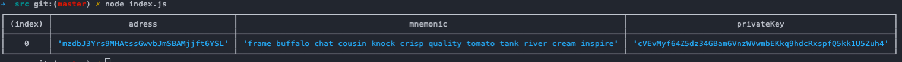

# CryptoWallet 🪙

Just a simple script to generate bitcoin wallet address

## 🚧 🚧 Under construction 🚧 🚧

---

## ⚙️ Installation

- Clone the repository
- `Enter the folder SRC `cd src/``
- Run ``yarn install``
- Run ``node index.js``

> It was developed with v17.2.0 not tested with other versions.

| Links                          | Description         \     |
|--------------------------------|---------------------------|
| https://www.blockchain.com/    | Check wallet transactions |
| https://electrum.org/#home     | wallet                    |
| https://bitcoinfaucet.uo1.net/ | generate transaction      |

## Open Electrum network testnet
``open -n /Applications/Electrum.app --args --testnet``